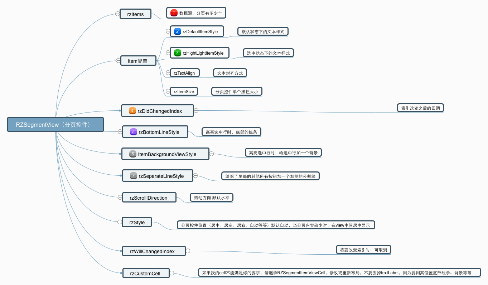
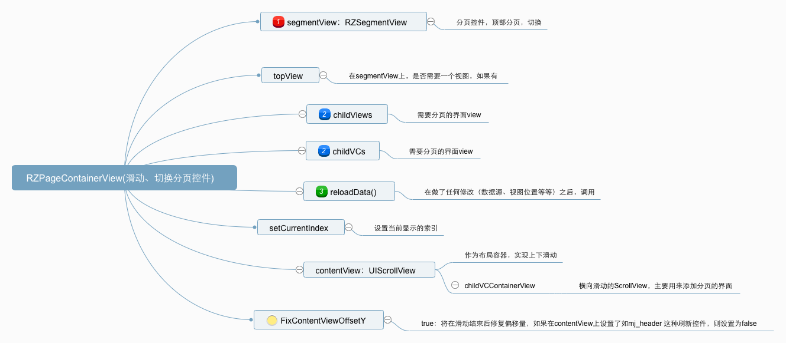

# 1. RZSegment

** 1. RZSegmentView **

<p align="center" >

</p>

* 继承自View，层级结构如下：(使用时，设置好Frame，因为要涉及样式，自动布局计算的时候不太方便，所以用frame布局)
>  UIView
>   > CollectionView
>   >   > Cell(文本)

* 其配置的属性
```
    /// 滚动方向 (水平、垂直)  默认水平
    var rzScrollDirection = RZSegmentView.RZScrollDirection.horizontal
```
```
    /// 样式(如果内容不能铺满，则自动居上，左，下，右，或中)  其中，水平支持左中右，垂直支持上中下
    var rzStyle = RZSegmentView.RZSegmentViewStyle.auto
```
```
// 文本对齐方式，默认居中
    var rzTextAlign : RZSegmentView.RZSegmentItemTextAlignStyle = .center
```
```
    // 默认item配置（未选中）
    var rzDefaultItemStyle = RZSegmentView.RZSegmentItemStyle.init(font: UIFont.systemFont(ofSize: 14), textColor: UIColor.init(white: 0.1, alpha: 0.7))
    // 高亮的时候的item配置（已选中）
    var rzHightLightItemStyle = RZSegmentView.RZSegmentItemStyle.init(font: UIFont.systemFont(ofSize: 15), textColor: UIColor.init(white: 0.1, alpha: 1))
```
```
    /// 标题
    var rzItems :[RZSegmentView.RZSegmentItemContent] = []
    
     > 其中，标题支持富文本
    //MARK:segment Item的内容
    struct RZSegmentItemContent {
        var text : String?
        var badge : String?
        // 如果设置这个，则badge无效 富文本的优先级高于文本
        var attributedBadge : NSAttributedString?
          // 高亮的富文本
        var hightLightAttributedBadge : NSAttributedString?
        
        // 如果设置这个，则text无效
        var attributedText : NSAttributedString?
        // 高亮的富文本
        var hightLightAttributedText: NSAttributedString?
        // 设置tag，可以做其他一些区分的事
        var tag = 0
    }
```
```
    // item的大小的配置
    var rzItemSize = RZSegmentView.RZSegmentItemSize.auto(leadingMargin: 15, height: 44)
```
```
    // 底部线条的配置
    var rzBottomLineStyle = RZSegmentView.RZSegmentBottomScrollLineStyle.none
```
```
    // 选中时，添加一个背景图层
    var rzItemBackgroundViewStyle = RZSegmentView.RZSegmentScrollBackgroundStyle.none
```
```
    // 每个cell右侧的分界线
    var rzSeparateLineStyle: RZSegmentSeparateLineStyle = .none
```
```
    /// 索引将要改变 return false时，不改变
    var rzWillChangedIndex:((_ view:RZSegmentView, _ index:Int) -> Bool)?
```


* 设置索引
```
// 改变当前选择的索引
    open func setCurrentIndex(index:Int, animation:Bool)
```

### 使用示例
```Swift
        let segment = RZSegmentView.init(frame: .init(x: 0, y: 160, width: self.view.frame.size.width, height: 44))
        self.view.addSubview(segment)
        segment.rzDefaultItemStyle = .init(font: .systemFont(ofSize: 14), textColor: .gray)
        segment.rzHightLightItemStyle = .init(font: .systemFont(ofSize: 16), textColor: .red)

        segment.rzDidChangedIndex = { (seg, index) in
            print("点击：\(index)")
        }
        segment.rzBottomLineStyle = .auto(leadingMargin: 10, height: 3, bottomMargin: 3, color: .red)
        // 默认样式为auto，当标题显示的文本宽度不能超过view本身的宽度，则居中显示
//        segment.rzStyle = .auto
        segment.rzItems = [
            .init(text: "标题", badge: "3"),
            .init(text: "标题"),
            .init(text: "标题"),
        ]
        segment.reloadData()
```
<p align="center" >

</p>


# 2. RZPageContainerView
> 可点击切换或者左右滑动切换界面

<p align="center" >

</p>

* RZPageContainerView 代码结构
	contentView:UIScrollView 作为主容器，实现上下滑动
		topView：顶部视图
		segmentView：分页按钮
		childVCContainerView:UIScrollView 左右切换界面的容器

* 使用
    1.将RZPageContainerView初始化加到自己的View上,不要使用自动布局，直接用frame，进入的时候需要布局计算滑动位置
```
    open init(frame: CGRect, delegate:RZPageContainerViewDelegate) 
```
其中delegate需要实现'RZPageContainerViewDelegate',设置好顶部悬浮时的偏移量位置

```
// 主界面的delegate
protocol RZPageContainerViewDelegate {
    // 最大移动的位移（悬停时，scrollview的contentOffset.y） 如果没有额外的topView，则为0
    func rzMaxContentOffsetY() -> CGFloat
}
```
2.配置segmentView
```
pageView?.segmentView.rzBottomLineStyle = .auto(leadingMargin: 5, height: 3, bottomMargin: 3, color: .red)
pageView?.segmentView.rzDefaultItemStyle = .init(font: .systemFont(ofSize: 15), textColor: .gray)
pageView?.segmentView.rzHightLightItemStyle = .init(font: .systemFont(ofSize: 17), textColor: .red)
pageView?.segmentView.rzItems = [
    .init(text: "最新"),
    .init(text: "热门"),
    .init(text: "关注"),
]
```

3.配置下边的需要切换的视图(可以是view，也可以是ViewController)
```
// 设置子controllers
let vc1 = ChildViewController()
vc1.title = "第一个文本"
let vc2 = ChildViewController()
vc2.title = "第二个文本"
let vc3 = ChildViewController()
vc3.title = "第三个文本"
        
self.addChild(vc1)
self.addChild(vc2)
self.addChild(vc3)
        
pageView?.childVCs = [vc1, vc2, vc3]
```
其中，'self'需要实现协议`RZPageContainerViewDelegate`
'ChildViewController'需要实现协议‘RZPageContainerChildViewDelegate’

```
// 需要翻页的界面的delegate
protocol RZPageContainerChildViewDelegate {
    func rzScrollView() -> UIScrollView?
}
// 主界面的delegate
protocol RZPageContainerViewDelegate {
    // 最大移动的位移（悬停时，scrollview的contentOffset.y） 如果没有额外的topView，则为0
    func rzMaxContentOffsetY() -> CGFloat
}
```
4.刷新数据
```
pageView?.reloadData()
```

### 备注
如果只是顶部悬停一个segmentView，下边是切换的界面，外层contentView是不可滑动的
如果在segment上还有一个topView，并且segmentView在上滑过程中需要悬停在导航栏底部，则需要配置topView的高度以及实现'rzMaxContentOffsetY'方法
如果需要在最外层contentView上添加下拉刷新，那么需要自己实现如mj_header，并且在刷新当前页完成之后，通知回调contentView关闭刷新状态
如果只是在内部切换界面下拉刷新，外部可以不做任何处理

<p align="center" >

</p>
