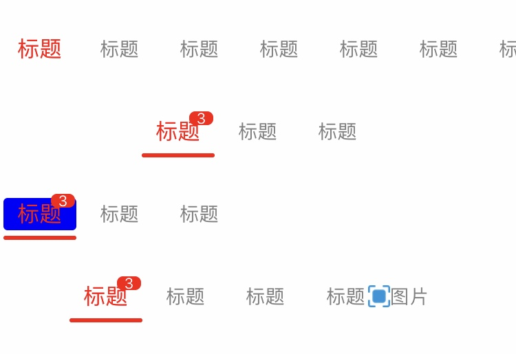
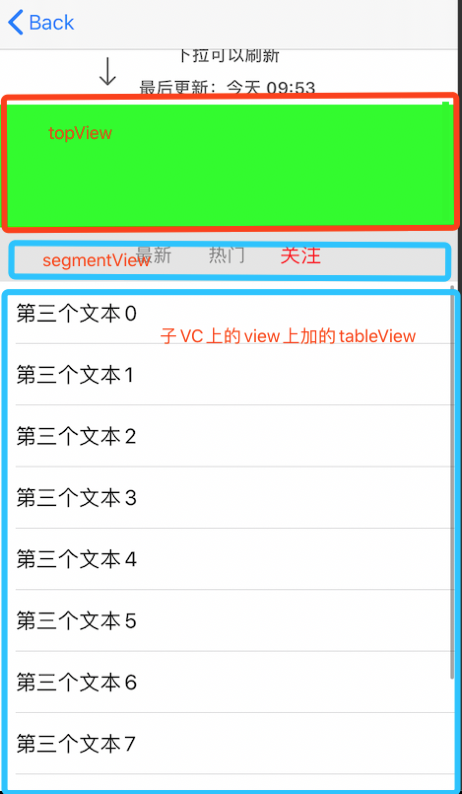

# 1. RZSegment

** 1. RZSegmentView **
* 继承自View，层级结构如下：(使用时，设置好Frame，因为要涉及样式，自动布局计算的时候不太方便，所以用frame布局)
>  UIView
>   > CollectionView
>   >   > Cell(文本)

* 其配置的属性
```
    /// 滚动方向 (水平、垂直)  默认水平
    var rzScrollDirection = RZSegmentView.RZScrollDirection.horizontal
```
```
    /// 样式(如果内容不能铺满，则自动居上，左，下，右，或中)  其中，水平支持左中右，垂直支持上中下
    var rzStyle = RZSegmentView.RZSegmentViewStyle.auto
```
```
// 文本对齐方式，默认居中
    var rzTextAlign : RZSegmentView.RZSegmentItemTextAlignStyle = .center
```
```
    // 默认item配置（未选中）
    var rzDefaultItemStyle = RZSegmentView.RZSegmentItemStyle.init(font: UIFont.systemFont(ofSize: 14), textColor: UIColor.init(white: 0.1, alpha: 0.7))
    // 高亮的时候的item配置（已选中）
    var rzHightLightItemStyle = RZSegmentView.RZSegmentItemStyle.init(font: UIFont.systemFont(ofSize: 15), textColor: UIColor.init(white: 0.1, alpha: 1))
```
```
    /// 标题
    var rzItems :[RZSegmentView.RZSegmentItemContent] = []
    
     > 其中，标题支持富文本
    //MARK:segment Item的内容
    struct RZSegmentItemContent {
        var text : String?
        var badge : String?
        // 如果设置这个，则badge无效 富文本的优先级高于文本
        var attributedBadge : NSAttributedString?
          // 高亮的富文本
        var hightLightAttributedBadge : NSAttributedString?
        
        // 如果设置这个，则text无效
        var attributedText : NSAttributedString?
        // 高亮的富文本
        var hightLightAttributedText: NSAttributedString?
        // 设置tag，可以做其他一些区分的事
        var tag = 0
    }
```
```
    // item的大小的配置
    var rzItemSize = RZSegmentView.RZSegmentItemSize.auto(leadingMargin: 15, height: 44)
```
```
    // 底部线条的配置
    var rzBottomLineStyle = RZSegmentView.RZSegmentBottomScrollLineStyle.none
```
```
    // 选中时，添加一个背景图层
    var rzItemBackgroundViewStyle = RZSegmentView.RZSegmentScrollBackgroundStyle.none
```
```
    // 每个cell右侧的分界线
    var rzSeparateLineStyle: RZSegmentSeparateLineStyle = .none
```
```
    /// 索引将要改变 return false时，不改变
    var rzWillChangedIndex:((_ view:RZSegmentView, _ index:Int) -> Bool)?
```


* 设置索引
```
// 改变当前选择的索引
    open func setCurrentIndex(index:Int, animation:Bool)
```

### 使用示例
```Swift
        let segment = RZSegmentView.init(frame: .init(x: 0, y: 160, width: self.view.frame.size.width, height: 44))
        self.view.addSubview(segment)
        segment.rzDefaultItemStyle = .init(font: .systemFont(ofSize: 14), textColor: .gray)
        segment.rzHightLightItemStyle = .init(font: .systemFont(ofSize: 16), textColor: .red)

        segment.rzDidChangedIndex = { (seg, index) in
            print("点击：\(index)")
        }
        segment.rzBottomLineStyle = .auto(leadingMargin: 10, height: 3, bottomMargin: 3, color: .red)
        // 默认样式为auto，当标题显示的文本宽度不能超过view本身的宽度，则居中显示
//        segment.rzStyle = .auto
        segment.rzItems = [
            .init(text: "标题", badge: "3"),
            .init(text: "标题"),
            .init(text: "标题"),
        ]
        segment.reloadData()
```
<p align="center" >

</p>


# 2. RZSegmentPagesView
> 可点击切换或者左右滑动切换界面

* RZSegmentPagesView 代码结构

        RZSegmentPagesView:UIView
        ┗ UITableView: (UITableView & RZPageViewsMultipleGesture)  // 这个TableView需要实现多手势响应 ，tableView有两个section
            ┗ 第一个sectionHeaderView，作为segmentView顶部额外的一些视图
                L 没有row
            ┗ 第二个sectionHeadeViewr，作为segmentView的父视图布局显示
                    ┗ UITableViewCell 第二个section下有一个row，作为切换界面的父视图
                            ┗ UICollectionView   需要切换的界面的父视图（加在UITableViewCell上）
                                ┗ UICollectionViewCell，作为切换界面的父视图
                                        ┗ Your ViewController.view 切换界面的view

* 使用
    1.将RZSegmentPagesView初始化加到自己的View上
```
public init (frame:CGRect, delegate:(RZSegmentPagesViewDelegate & UIViewController)?)
```
其中delegate是一个`UIViewController`，因为在切换时，需要将其`子UIViewController`加到当前delegate的`childViewController`中，并且引用了`RZSegmentPagesView`之后，当前`UIViewController`需要实现协议`RZSegmentPagesViewDelegate`
```
// segmentPagesViewControllerDelegate 需要实现的协议
public protocol RZSegmentPagesViewDelegate {
    /// 子childViewController的view的高度，如果返回nil，则默认为 RZSegmentPagesView 的高度-segmentView的高度
    func rzSegmentPagesChildViewHeight(segmentPagesView:RZSegmentPagesView, index:Int) -> CGFloat
    /// segmentView的高度 默认44
    func rzSegmentViewHeight(segmentPagesView:RZSegmentPagesView, index:Int) -> CGFloat
    /// 在segmentView上是否有其他视图
    func rzSegmentPagesHasTopView(segmentPagesView:RZSegmentPagesView, index:Int) -> Bool
    // 在segmentView上如果有额外的视图时，请返回此视图
    func rzSegmentPagesTopView(_ view:RZSegmentPagesView, index:Int) -> UIView
    /// 顶部视图的高度
    func rzSegmentPagesTopViewHeight(segmentPagesView:RZSegmentPagesView, index:Int) -> CGFloat
}
```
2.配置segmentPagesView.segmentView.rzTimes (配置切换的标题segment)
```
let segmentPagesView = RZSegmentPagesView.init(frame: self.view.bounds, delegate: self)
self.segmentPagesView.segmentView.rzItems = [
            .init(text: "最新"),
            .init(text: "热门"),
            .init(text: "关注"),
        ]
segmentPagesView.segmentView.rzDefaultItemStyle = .init(font: .systemFont(ofSize: 15), textColor: .gray)
segmentPagesView.segmentView.rzHightLightItemStyle = .init(font: .systemFont(ofSize: 17), textColor: .red)
```
3.配置下边的需要切换的视图
```
// 设置子controllers
self.segmentPagesView.childControllers = [
    ChildViewController(),
    ChildViewController(),
    ChildViewController(),
]
```
其中，ChildViewController需要实现协议`RZSegmentPagesChildViewControllerDelegate`
```
// 要实现滑动，需要添加的子childViewController实现以下协议
public protocol RZSegmentPagesChildViewControllerDelegate {
    /// 获取当前界面的scrollView到顶的时候的offset，
    /// 如果tableView这种没有下拉刷新，则返回0，有下拉刷新的时候，会有一个偏移量，比如MJRefresh的mj_header 设为 -44
    func getScrollViewTopOffsetY() -> CGFloat
    /// 获取当前界面的scrollView，如果没有返回0.。。在控制悬停以及多手势时，需要其做处理
    func getScrollView() -> UIScrollView?
    /// 通知子controller需要刷新了，需要自行实现
    /// 如设置了RZSegmentPagesView的tableview的mj_header, 在触发了刷新之后，通过segmentPages的childControllers以及currentIndex，去刷新当前index的vc的数据，并请在子vc刷新数据回来之后，给complete回调，以关闭segmentPagesView的刷新状态
    /// - Parameter complete: 刷新数据完成之后的回调
    func beginRefresh(complete:(() -> Void)?)
}
```
4.刷新数据
```
segmentPagesView.reloadData()
```

### 备注
> topView是在segment上显示的，不是设置在tableView.tableHeaderView上，是因为异步网络加载数据返回回来之后，刷新界面时，会先加载topview在reload，会有跳动，交互不友好，所以直接设置两个section，topView是加在第一个section的header上，第一个section没有row
而segment是加在第二个section的header上，第二个section有一个row，用来加载切换的VC

> 当需要实现上拉下拉刷新加载更多数据的时候，如果没有topView，可以直接在子VC里去实现tableView的刷新和加载更多
> 如果有topView，那么刷新的时候可能还需要刷新topView，这个时候刷新的机制（在最外层的tableView上刷新、以及子VC上刷新，交互上会有冲突，不友好，建议在最外层刷新tableView，并且在`RZSegmentPagesChildViewControllerDelegate`子VC实现的协议中，让其刷新，则子VC的tableView不设置下拉刷新操作）

<p align="center" >

</p>
